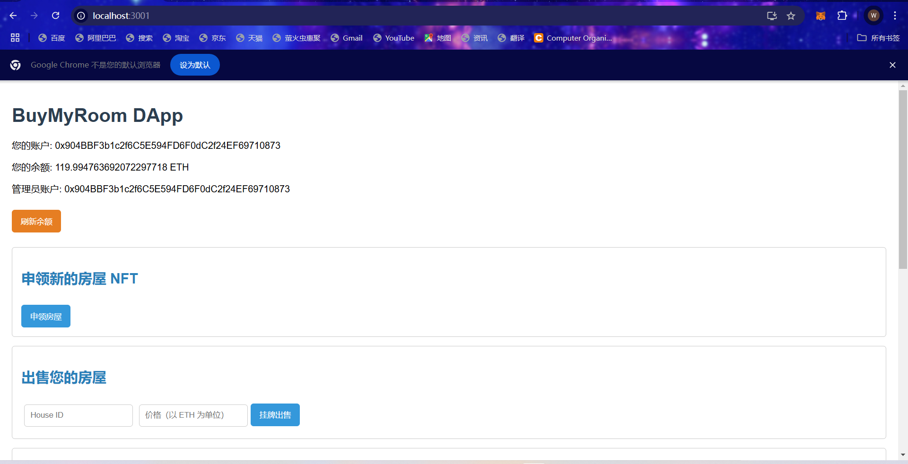

# ZJU-blockchain-course-2024

------

## 项目介绍

去中心化房屋购买系统，参与方包括：房屋拥有者，有购买房屋需求的用户

建立一个简易的房屋出售系统，在网站中：
- 创建一个（ERC721）合约，在合约中发行房屋集合，每个NFT代表一栋房屋。让部分用户免费领取部分房屋NFT，用于后面的测试。
- 在网站中，用户可以出售，或者使用测试以太币购买房屋。每个用户可以： 
 1. 用户查看自己拥有的房产列表。并可以挂单出售自己的房屋（挂单包含价格等信息）。
 2. 用户查看所有出售中的房产，并查询一栋房产的主人，及各种挂单信息。
 3. 用户选择支付房屋价格对应的测试以太币，购买某个其他用户出售的房产。购买后房产拥有权应当发生变化。
 4. 平台收取手续费：在一个房产出售完成时，用户支付的部分测试以太币（=某栋房产在平台上的挂单时长（timestamp）* 固定比例 * 房产价格）应该被转入某个特定账户（如合约部署者）。
    

## 如何运行

#### 以太坊私有链搭建

1. 在本地启动ganache应用，设置 RPC URL 和一些其他设置。记录下所有账号的地址和私钥。


#### 合约编译与部署

1. 在 `./contracts` 中安装需要的依赖，运行如下的命令：
    ```bash
    npm install
    ```

2. 在 `./contracts` 中编译合约，运行如下的命令：
    ```bash
    npx hardhat compile
    ```

3. 修改 `hardhat.config.ts` 文件中的 networks 有关 ganache 的配置（url和账户私钥，其中第一个账户私钥默认作为合约部署方），示例如下：

    ```typescript
    const config: HardhatUserConfig = {
      solidity: "0.8.20",
      networks: {
        ganache: {
          // rpc url, change it according to your ganache configuration
          url: 'http://localhost:8545',
          // the private key of signers, change it according to your ganache user
          accounts: [
              '0x99e35f7e5841f5e902d77b1773250ba772947d1d10eee4813e53fbb3644116cf',
              '0x50f77f4b4f7e33ca5742f2f69175b53ccbe40b0a8f4fe64c3c0485b118c54d68',
              '0xb8cb736a767c4f7bd6bb85f5a8dd9597f12d4c3ca341b8d78eb1ab6d532967ea',
              '0x7f6737b4052091b9d90f61ab8cb5fe638fa255aab8f7c04faa93e2c766a93ee0'
          ]
        },
      },
    };
    ```

4. 部署合约文件，在 `./contracts` 中部署合约，运行如下的命令：

    ```
    npx hardhat run .\scripts\deploy.ts --network ganache
    ```

    记录下控制台输出的合约部署地址，控制台输出示例如下：

    ```
    BuyMyRoom deployed to 0x6129f9f57c57B1d28922112B8C7a637D48d9dDbd
    Contract manager is: 0x904BBF3b1c2f6C5E594FD6F0dC2f24EF69710873
    ```


#### 前端

1. 将合约编译后生成的 `contracts/artifacts/contracts/BuyMyRoom.sol/BuyMyRoom.json`文件拷贝到`frontend/src/utils/abis`目录下

2. 修改 `frontend/src/utils/contract-addresses.json`文件中的地址，改为合约部署地址

3. 在 `./frontend` 中安装需要的依赖，运行如下的命令：

    ```bash
    npm install
    ```

4. 在 `./frontend` 中启动前端程序，运行如下的命令：

    ```bash
    npm run start
    ```

    确保浏览器已经安装 MetaMask 插件，并导入 Ganache 生成的账户，然后在浏览器端通过 MetaMask 连接这些账户


## 功能实现分析

该项目是一个去中心化应用程序（DApp），实现了基于以太坊的房屋 NFT 铸造、出售和购买功能。以下是各个功能的详细描述及其实现方式：

### 合约实现

1. **房屋 NFT 的铸造**：
   - **功能描述**：用户可以通过调用 `mintHouse` 函数自助铸造新的房屋 NFT。每个 NFT 代表一套房屋，铸造后默认由调用者所有。
   - 实现方式：
     - 用户通过前端调用智能合约的 `mintHouse` 函数。
     - 函数内部生成一个唯一的 `tokenId`，并调用 `_mint` 函数将该 NFT 铸造给调用者。
     - 房屋的初始价格设为 0 ETH，挂单时间戳记录为当前时间，状态设为未出售。
     - 铸造成功后，合约会在控制台输出铸造信息。
2. **挂牌出售房屋**：
   - **功能描述**：房屋拥有者可以将其 NFT 挂牌出售，指定出售价格。挂牌后，其他用户可以查看并购买该房屋。
   - 实现方式：
     - 房屋拥有者通过前端输入房屋的 `tokenId` 和出售价格，并调用智能合约的 `listHouse` 函数。
     - 合约会验证调用者是否为房屋的当前拥有者，更新房屋的价格、挂单时间戳，并将状态标记为在售。
     - 成功挂牌后，合约触发 `HouseListed` 事件，记录挂牌信息。
3. **购买房屋**：
   - **功能描述**：用户可以通过调用 `buyHouse` 函数购买挂牌出售的房屋。在购买时，合约会处理支付和手续费的计算。
   - 实现方式：
     - 用户在前端输入要购买的房屋 `tokenId`，并通过调用 `buyHouse` 函数发起购买。
     - 合约检查该房屋是否在售，并验证用户的支付金额是否达到房屋的售价。
     - 根据房屋的挂牌时间计算手续费（这里会通过一定的逻辑运算保证手续费最高不超过设定的比例），并将相应的 ETH 转账给管理员和卖家。
     - 完成交易后，更新房屋的拥有者信息，将房屋状态改为未出售，并触发 `HouseSold` 事件，记录交易信息。
4. **获取房屋信息**：
   - **功能描述**：用户可以通过 `getHouseInfo` 函数查询特定房屋的详细信息，包括拥有者、价格、挂单时间和是否在售。
   - 实现方式：
     - 用户输入要查询的房屋 `tokenId`，调用 `getHouseInfo` 函数。
     - 合约根据 `tokenId` 返回对应的房屋结构体信息。
5. **获取用户拥有的房屋列表**：
   - **功能描述**：用户可以查看自己拥有的所有房屋 NFT 的信息。
   - 实现方式：
     - 用户调用 `getMyHouses` 函数，该函数会遍历所有房屋，筛选出属于调用者的房屋。
     - 将每个房屋的信息（如 `houseId` （也即 `tokenId`）、拥有者、价格、挂单时间、在售状态）存储到 `HouseDTO` 数组中返回。
6. **获取所有挂牌出售的房屋**：
   - **功能描述**：用户可以查看当前所有挂牌出售的房屋列表。
   - 实现方式：
     - 用户调用 `getAllListedHouses` 函数，合约会遍历所有房屋，筛选出状态为在售的房屋。
     - 同样将筛选出的房屋信息存储到 `HouseDTO` 数组中返回。

### 前端实现

前端使用 React 框架构建，主要负责用户与智能合约的交互。具体实现包括以下几个方面：

1. **以太坊钱包连接**：
   - 使用 `web3.js` 库连接用户的以太坊钱包（如 MetaMask）。
   - 在应用加载时，使用 `web3.eth.getAccounts()` 获取用户账户信息，并显示在界面上。
   - 提供反馈机制以处理连接失败的情况，确保用户能够清楚地知道是否成功连接。
2. **获取用户余额**：
   - 调用 `web3.eth.getBalance(account)` 获取用户的 ETH 余额，并转换为以太坊单位（ETH）进行显示。
   - 提供“刷新余额”按钮，允许用户在进行交易后手动更新余额。
3. **铸造房屋 NFT**：
   - 提供一个按钮用于铸造新的房屋 NFT，点击后调用 `mintHouse` 函数。
   - 在铸造过程中，显示加载状态，确保用户在等待时有视觉反馈。
   - 成功铸造后，自动更新页面以显示最新的数据。
4. **挂牌出售房屋**：
   - 用户输入房屋的 `tokenId` 和售价（ETH），然后点击“挂牌出售”按钮。
   - 调用 `listHouse` 函数，将用户输入的数据传递给智能合约。
   - 在提交挂牌请求后，展示加载状态，并在成功后更新房屋列表。
5. **购买房屋**：
   - 用户可以输入要购买的房屋 ID，并通过点击“购买房屋”按钮进行交易。
   - 前端首先调用智能合约的 `houses(tokenId)` 方法获取房屋的当前价格，并确保用户提供的支付金额足够。
   - 在交易过程中，显示加载状态，并在交易完成后自动更新房屋列表和用户的房屋信息。
6. **获取用户拥有的房屋列表**：
   - 提供一个“刷新”按钮，用户可以点击获取自己所拥有的所有房屋 NFT。
   - 调用智能合约的 `getMyHouses` 方法，并将返回的房屋信息存储在组件的状态中。
   - 使用 `map` 方法将房屋信息渲染为列表，清晰地展示每个房屋的 ID、拥有者、价格、挂单时间和在售状态。
7. **获取所有挂牌出售的房屋**：
   - 类似于获取用户房屋的功能，前端也提供了获取所有挂牌出售房屋的功能。
   - 用户可以点击“刷新”按钮以更新当前所有在售房屋的信息。
   - 调用 `getAllListedHouses` 方法并将结果存储在状态中，使用 `map` 方法将所有挂牌房屋的信息展示在列表中。


## 项目运行截图

##### 初始界面

> ***刚进入界面或切换账号后需要点击刷新按钮刷新一下账户信息（余额显示、所属房屋列表等）***




##### 铸造房屋


点击确认后，就可以申领一个房屋


从上图可以看出已经增加了一个房屋


##### 挂牌出售房屋

填入想要出售房屋的 House ID 已经出售价格，即可出售房屋


##### 购买房屋及手续费收取

> 需要注意的是：由于我在智能合约里没有对手续费设置上限，所以购买房屋一定要在较短的时间内完成（即挂单时长建议控制在2分钟内），否则会出现手续费超过 房价本身而导致 交易失败

此时该账户余额约 119ETH，下面切换账号3（非管理员账号）进行购买，然后观察购买者、出售者已经管理员（即合约部署者）三者的余额变化

此时账号信息如下：


为了更清晰地检验合约编写的合理性与正确性，我将用User 1 挂售一个房屋，用 User 2去购买（House ID 为 2的房屋是User 1的），相关截图如下：


交易完成后三方的余额变更如下，很明显的看到 Manager 余额多了余额 5ETH（手续费），User 1多了约 10 ETH，User 2少了 15ETH。


## 参考内容

- 课程的参考Demo见：[DEMOs](https://github.com/LBruyne/blockchain-course-demos)。
- 快速实现 ERC721 和 ERC20：[模版](https://wizard.openzeppelin.com/#erc20)。记得安装相关依赖 `"@openzeppelin/contracts": "^5.0.0"`。
- 如何实现ETH和ERC20的兑换？ [参考讲解](https://www.wtf.academy/en/docs/solidity-103/DEX/)
